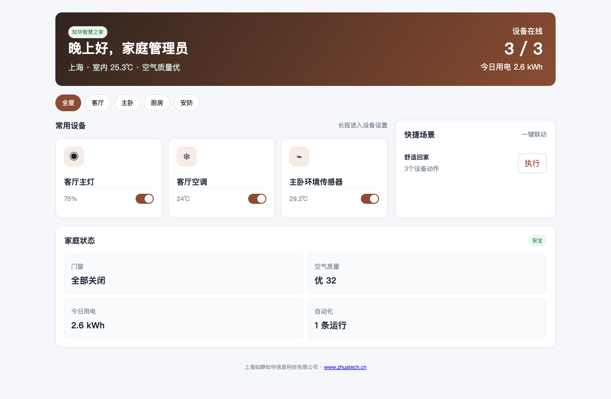
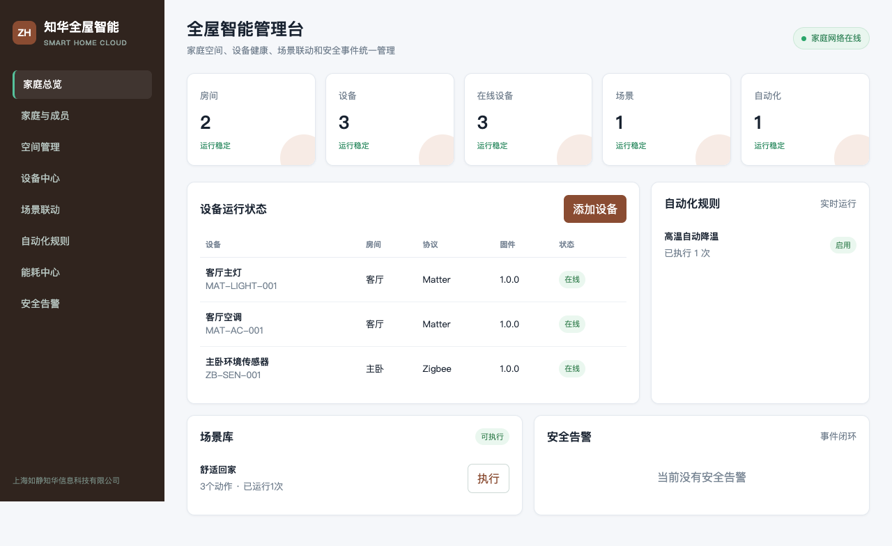

# 知华全屋智能与家庭物联网平台

[简体中文](README.md) | [English](README.en.md)

从“单设备遥控”走向“空间、成员、场景和自动化协同”。`zhuatech-smart-home` 是知华科技面向家庭、样板间、精装住宅与养老看护场景推出的社区源码项目。

[知华科技（上海如静知华信息科技有限公司）](https://www.zhuatech.cn/)提供中小企业AI转型、IoT平台、软件外包与定制开发服务。商业咨询微信：`zhuatech` / `zhuatech2`。

## 你可以直接看到什么





## 四层能力模型

### 1. 家庭与权限

家庭是数据和权限边界；支持拥有者、管理员、普通成员与限时访客。设备控制、场景配置、告警处置均在领域层检查成员归属和角色。

### 2. 空间与设备

支持房间、楼层、设备序列号、Matter/Zigbee/蓝牙/Wi-Fi协议标识、能力清单、固件版本与在线状态。设备命令会校验能力，不支持的属性无法写入。

### 3. 场景与自动化

场景可编排多个设备动作；执行前会整体检查设备在线状态。自动化支持 `eq`、`gt`、`lt` 条件，由传感器事件触发场景，事件编号自动去重。

### 4. 能耗与安全

累计电量读数禁止回退，并计算增量能耗。烟雾、燃气、漏水和入侵事件会形成安全告警，支持责任人处理和闭环审计。

## 内置业务闭环

- 家庭创建和拥有者初始化；
- 成员邀请、角色授权和访客有效期；
- 房间管理、设备配网、状态与命令日志；
- 多设备场景创建与执行；
- 传感器事件、自动化匹配和联动执行；
- 累计能耗采集和家庭用能汇总；
- 安防告警创建、合并和处置。

## 运行项目

```bash
cp .env.example .env
npm test
SMARTHOME_API_KEY=zhuatech-demo-key npm start
```

家庭端：`http://127.0.0.1:18104/`

管理端：`http://127.0.0.1:18104/console`

容器运行：`docker compose up --build`

项目使用 Node.js 20+，不依赖第三方运行库。默认 JSON 快照适合本地学习；MySQL 8 表结构见 `database/schema.sql`。真实 Matter、Zigbee 网关和语音助手应通过设备适配层接入，本仓库提供完整业务功能，但不虚构任何真实硬件认证。

## 工程质量

自动化测试覆盖角色权限、设备能力校验、多动作场景、自动化触发、事件去重和烟雾告警闭环。API、架构、安全、贡献规范和 Docker 文件均已包含。

## 使用许可

本项目只允许个人、非商业性的学习、研究和技术交流。企业生产使用、房地产项目交付、SaaS、设备预装、收费服务或二次销售需要上海如静知华信息科技有限公司书面商业授权。带有非商业限制，因此项目为 source-available 社区源码，不是 OSI 开源许可证项目。

| `zhuatech` | `zhuatech2` |
| --- | --- |
|  |  |

Copyright © 上海如静知华信息科技有限公司。
